# Backend Architecture

This document provides an overview of the finlayhu-backend infrastructure architecture.

## Overview

The backend is built using AWS CDK and consists of five main stacks:

- **DatabaseStack**: DynamoDB table for health and fitness data storage
- **OuraStack**: Health data collection from Oura Ring API
- **StravaStack**: Fitness activity data collection from Strava API
- **InfraStack**: Main website and API endpoints
- **ChalkboardStack**: Separate subdomain for Chalkboard UI

## Architecture Diagram

```mermaid
graph TB
    subgraph "External Services"
        OURA[Oura Ring API<br/>api.ouraring.com]
        STRAVA[Strava API<br/>www.strava.com/api/v3]
        ZEN[Zen Quotes API<br/>zenquotes.io]
    end

    subgraph "AWS Infrastructure"
        subgraph "DatabaseStack"
            DDB[DynamoDB: HealthDataTable<br/>PK: OURA#date / STRAVA#date<br/>SK: SLEEP / ACTIVITY#id / SUMMARY]
        end

        subgraph "OuraStack"
            EB[EventBridge<br/>Hourly Cron]
            SM[Secrets Manager<br/>OURA_API_KEY]
            SYNC_OURA[Lambda: sync-oura-data<br/>Timeout: 10s]
            S3_OURA[S3: OuraData Bucket<br/>oura-data-YYYY-MM-DD-HH.json]
            EB -->|Triggers Hourly| SYNC_OURA
            SM -->|Provides API Key| SYNC_OURA
            OURA -->|Fetch Health Data| SYNC_OURA
            SYNC_OURA -->|Store JSON| S3_OURA
            SYNC_OURA -->|Write/Overwrite| DDB
        end

        subgraph "StravaStack"
            EB_STRAVA[EventBridge<br/>Hourly Cron]
            SM_STRAVA[Secrets Manager<br/>STRAVA_SECRETS<br/>OAuth Tokens]
            SYNC[Lambda: sync-strava<br/>Timeout: 30s]
            S3_STRAVA[S3: StravaData Bucket<br/>strava-data-YYYY-MM-DD-HH.json]
            EB_STRAVA -->|Triggers Hourly| SYNC
            SM_STRAVA -->|Provides OAuth Tokens| SYNC
            STRAVA -->|Fetch Activities| SYNC
            SYNC -->|Refresh Tokens| SM_STRAVA
            SYNC -->|Store JSON| S3_STRAVA
            SYNC -->|Write/Overwrite| DDB
        end

        subgraph "InfraStack"
            S3_WEB[S3: Website Bucket<br/>Static Content]

            subgraph "Lambda Functions"
                QOTD[Lambda: get-qotd]
                GET_OURA[Lambda: get-oura-data]
                GET_STRAVA[Lambda: get-strava-data]
                INVALID1[Lambda: invalidate-cloudfront]
            end

            subgraph "API Gateway"
                API1[REST API<br/>/api/qotd]
                API2[REST API<br/>/api/oura<br/>/api/oura/date]
                API3[REST API<br/>/api/strava<br/>/api/strava/date]
            end

            CF1[CloudFront Distribution<br/>fhudson.com<br/>*.fhudson.com]

            ZEN -->|Fetch Quote| QOTD
            API1 --> QOTD
            API2 --> GET_OURA
            API3 --> GET_STRAVA
            DDB -->|Read Data| GET_OURA
            DDB -->|Read Data| GET_STRAVA
            S3_OURA -.->|Fallback Read| GET_OURA
            S3_STRAVA -.->|Fallback Read| GET_STRAVA

            S3_WEB -->|S3 Events| INVALID1
            INVALID1 -->|Create Invalidation| CF1

            CF1 -->|Route: /| S3_WEB
            CF1 -->|Route: /api/qotd<br/>Cache: 24h| API1
            CF1 -->|Route: /api/oura*<br/>Cache: 1h| API2
            CF1 -->|Route: /api/strava*<br/>Cache: 30min| API3
        end

        subgraph "ChalkboardStack"
            S3_CHALK[S3: chalkboard-ui Bucket<br/>Static Content]
            INVALID2[Lambda: invalidate-cloudfront]
            CF2[CloudFront Distribution<br/>chalkboard.fhudson.com]

            S3_CHALK -->|S3 Events| INVALID2
            INVALID2 -->|Create Invalidation| CF2
            CF2 -->|Default Origin| S3_CHALK
        end
    end

    subgraph "Clients"
        WEB[Web Browsers<br/>fhudson.com<br/>chalkboard.fhudson.com]
    end

    WEB -->|HTTPS Requests| CF1
    WEB -->|HTTPS Requests| CF2

    classDef lambda fill:#FF9900,stroke:#232F3E,stroke-width:2px,color:#000
    classDef s3 fill:#569A31,stroke:#232F3E,stroke-width:2px,color:#fff
    classDef api fill:#FF4F8B,stroke:#232F3E,stroke-width:2px,color:#fff
    classDef cf fill:#8C4FFF,stroke:#232F3E,stroke-width:2px,color:#fff
    classDef external fill:#3B48CC,stroke:#232F3E,stroke-width:2px,color:#fff
    classDef client fill:#232F3E,stroke:#FF9900,stroke-width:2px,color:#fff
    classDef event fill:#E7157B,stroke:#232F3E,stroke-width:2px,color:#fff
    classDef dynamodb fill:#4053D6,stroke:#232F3E,stroke-width:2px,color:#fff

    class QOTD,GET_OURA,GET_STRAVA,SYNC_OURA,SYNC,INVALID1,INVALID2 lambda
    class S3_WEB,S3_OURA,S3_STRAVA,S3_CHALK s3
    class API1,API2,API3 api
    class CF1,CF2 cf
    class OURA,STRAVA,ZEN external
    class WEB client
    class EB,EB_STRAVA,SM,SM_STRAVA event
    class DDB dynamodb
```



## Key Components

### Lambda Functions

- **sync-oura-data**: Fetches health data from Oura API hourly, stores in S3 and DynamoDB
- **get-oura-data**: Retrieves Oura data from DynamoDB (with S3 fallback) for API requests
- **sync-strava**: Fetches activity data from Strava API hourly, handles OAuth token refresh, stores in S3 and DynamoDB
- **get-strava-data**: Retrieves Strava data from DynamoDB (with S3 fallback) for API requests
- **get-qotd**: Fetches Quote of the Day from Zen Quotes API
- **invalidate-cloudfront**: Invalidates CloudFront cache when S3 content changes

### Storage

- **HealthDataTable (DynamoDB)**: Primary storage for health and fitness data
  - Uses overwrite pattern: each hourly sync replaces existing data for the day
  - Oura: 4 records per day (SLEEP, READINESS, ACTIVITY, WORKOUT)
  - Strava: 1 record per activity + 1 SUMMARY per day
  - GSI1: Query by data type and date range
  - GSI2: Query Strava activities by type
- **OuraData S3 Bucket**: Legacy storage, used as fallback (`oura-data-YYYY-MM-DD-HH.json`)
- **StravaData S3 Bucket**: Legacy storage, used as fallback (`strava-data-YYYY-MM-DD-HH.json`)
- **Website S3 Bucket**: Hosts static website content for fhudson.com
- **Chalkboard S3 Bucket**: Hosts static content for chalkboard.fhudson.com subdomain

### API Endpoints

- `GET /api/qotd`: Returns daily quote (24-hour cache)
- `GET /api/oura`: Returns today's Oura health data (1-hour cache)
- `GET /api/oura/{date}`: Returns specific date's health data (1-hour cache)
- `GET /api/strava`: Returns today's Strava activities (30-minute cache)
- `GET /api/strava/{date}`: Returns specific date's activities (30-minute cache)

### CDN & Caching

- **CloudFront Distributions**: Two distributions serving different domains
  - fhudson.com and \*.fhudson.com (main site + APIs)
  - chalkboard.fhudson.com (Chalkboard UI)
- **Cache Policies**:
  - Quote API: 24-hour TTL
  - Oura API: 1-hour TTL
  - Strava API: 30-minute TTL
  - Static content: Optimized caching with automatic invalidation

### Scheduled Jobs

- **EventBridge Rule (Oura)**: Triggers sync-oura-data Lambda every hour at the top of the hour
- **EventBridge Rule (Strava)**: Triggers sync-strava Lambda every hour at the top of the hour

## External Integrations

### Oura Ring API

- **Base URL**: https://api.ouraring.com/v2/usercollection/
- **Authentication**: Bearer token stored in AWS Secrets Manager
- **Endpoints Used**:
  - `/daily_sleep`: Sleep metrics
  - `/daily_activity`: Activity and exercise metrics
  - `/daily_readiness`: Readiness scores
  - `/workout`: Workout data

### Strava API

- **Base URL**: https://www.strava.com/api/v3/
- **Authentication**: OAuth 2.0 with automatic token refresh (tokens expire every 6 hours)
- **Secrets**: Stored in AWS Secrets Manager (`STRAVA_SECRETS`)
  - `STRAVA_CLIENT_ID`
  - `STRAVA_CLIENT_SECRET`
  - `STRAVA_ACCESS_TOKEN`
  - `STRAVA_REFRESH_TOKEN`
  - `STRAVA_EXPIRES_AT`
- **Endpoints Used**:
  - `/athlete/activities`: List of athlete activities
- **Features**:
  - Includes segment efforts and PRs
  - Activity summaries with distance, time, elevation, heart rate
  - Rate limit safe: ~72 API calls/day (well under 1,000 limit)

### Zen Quotes API

- **URL**: https://zenquotes.io/api/today
- **Authentication**: None required
- **Purpose**: Daily inspirational quote

## Security

- HTTPS enforced via AWS Certificate Manager
- Oura API key stored in AWS Secrets Manager
- Strava OAuth tokens stored in AWS Secrets Manager (with automatic refresh)
- S3 buckets restricted to CloudFront Origin Access Identity
- DynamoDB access controlled via IAM roles
- IAM roles follow least privilege principle
- CORS enabled for API endpoints

## Data Flow

### Health Data Collection Flow (Oura)

1. EventBridge triggers sync-oura-data Lambda every hour
2. Lambda retrieves API key from Secrets Manager
3. Makes parallel requests to Oura API endpoints
4. Saves to S3 with timestamp (legacy, for fallback)
5. Writes/overwrites to DynamoDB (primary storage)

### Activity Data Collection Flow (Strava)

1. EventBridge triggers sync-strava Lambda every hour
2. Lambda retrieves OAuth tokens from Secrets Manager
3. Checks if access token is expired; if so, refreshes using refresh token
4. Updates Secrets Manager with new tokens if refreshed
5. Fetches today's activities from Strava API
6. Calculates summary statistics (total distance, time, elevation, etc.)
7. Saves to S3 with timestamp (legacy, for fallback)
8. Writes activities and summary to DynamoDB (primary storage)

### API Request Flow

1. Client makes HTTPS request to fhudson.com/api/\*
2. CloudFront checks cache
3. If cache miss, routes to API Gateway
4. API Gateway invokes appropriate Lambda
5. Lambda queries DynamoDB (falls back to S3 if no data found)
6. Response cached at CloudFront edge locations
7. Response returned to client

## Deployment

Built with AWS CDK using TypeScript. Deploy all stacks with:

```bash
npm run build
cdk deploy --all
```

Or deploy in order:

```bash
cdk deploy DatabaseStack
cdk deploy OuraStack StravaStack
cdk deploy InfraStack
cdk deploy ChalkboardStack
```
